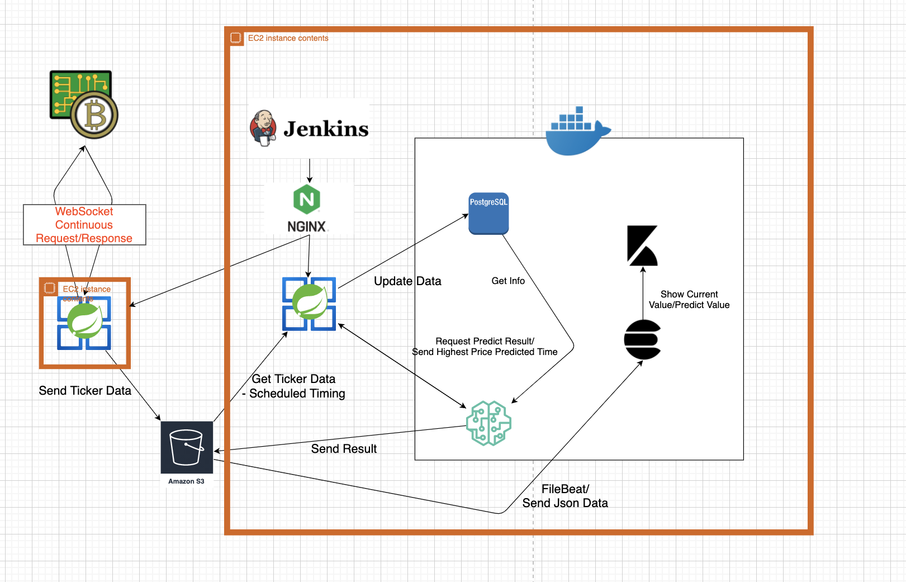

- 웹소켓 통신 위해 neovisionaries 라이브러리 사용
- 끊기지 않는 웹소켓 통신 위해서 Publisher-Subscriber 패턴 활용
- 웹소켓 통신에서 receive 메시지 받는 method와 실제로 send 하는 부분이 작동하는 thread 차이 completableFuture.get() 으로 극복
- AWS S3으로 직접 데이터 송신하여 유실 방지
- Kibana 대시보드 활용을 위해 ElasticSearch 사용
- Spring Boot : Crontab 활용해 특정 시기에 기존 Postgre Table Ticker 정보 update
- Highest Price Time 예측을 위해 CNN 모델 Flask Server Docker Image 생성
- Flask Server 에서 predict 결과 S3에 업로드
- 무중단 배포 위해 Nginx 사용
- 도커 컨테이너 이미지에 elasticsearch, kibana 사용 및 로컬에서 만든 DL 모델 삽입
- CI/CD 툴로서 Jenkins 를 활용
- GitHub WebHook 으로 push 시 trigger 발생시켜 Jenkins 빌드 자동화
